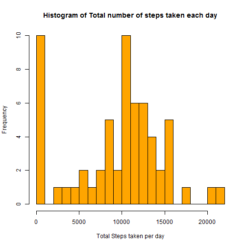
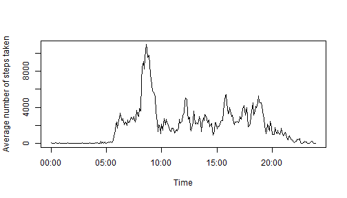
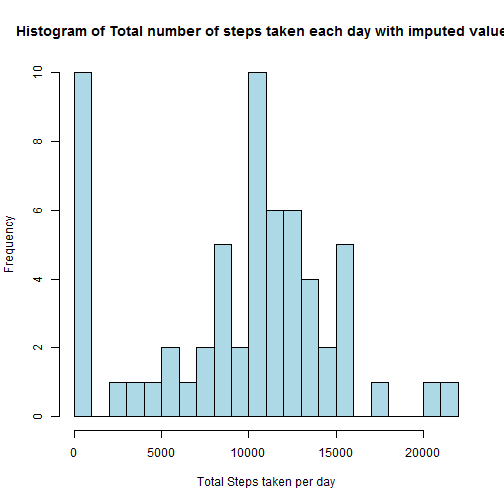
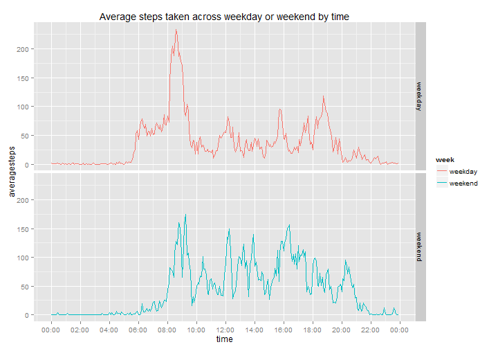

For this report, I'll be using data which is collected using a personal activity monitoring device on the number of steps taken in 5 minute intervals each day by an anonymous individual during October and November 2012.

The following R packages would be used in the analysis & I would load them first :

* dplyr : to compute totals & means
* xtable : to tabulate the results
* ggplot2 : to plot charts with comparison
* scales : to access breaks/formatting functions for ggplot2

```r
library(dplyr)
library(xtable)
library(ggplot2)
library(scales)
```


To show all R codes by default as required, I'll set global options `echo=TRUE` first.

```r
library(knitr)
opts_chunk$set(echo=TRUE)
```

###Loading and preprocessing the data
Please ensure that the dataset "activity.csv" is in the working directory before loading. The interval identifier is converted to time format HH:MM.

```r
data<-read.csv("activity.csv")
data$interval<-sprintf("%04d", data$interval)
data$time <- as.POSIXct(strptime(data$interval, format="%H%M"))
```

###What is mean total number of steps taken per day?
Using the dplyr package, I computed the total number of steps taken per day. The data is then tabulated using the xtable package below.

```r
aggregates<-summarise(group_by(data,date),totalsteps=sum(steps,na.rm=TRUE))
library(xtable)
tableaggregates<-xtable(aggregates)
print.xtable(tableaggregates,type="html")
```

<!-- html table generated in R 3.1.2 by xtable 1.7-4 package -->
<!-- Sun May 17 21:21:50 2015 -->
<table border=1>
<tr> <th>  </th> <th> date </th> <th> totalsteps </th>  </tr>
  <tr> <td align="right"> 1 </td> <td> 2012-10-01 </td> <td align="right">   0 </td> </tr>
  <tr> <td align="right"> 2 </td> <td> 2012-10-02 </td> <td align="right"> 126 </td> </tr>
  <tr> <td align="right"> 3 </td> <td> 2012-10-03 </td> <td align="right"> 11352 </td> </tr>
  <tr> <td align="right"> 4 </td> <td> 2012-10-04 </td> <td align="right"> 12116 </td> </tr>
  <tr> <td align="right"> 5 </td> <td> 2012-10-05 </td> <td align="right"> 13294 </td> </tr>
  <tr> <td align="right"> 6 </td> <td> 2012-10-06 </td> <td align="right"> 15420 </td> </tr>
  <tr> <td align="right"> 7 </td> <td> 2012-10-07 </td> <td align="right"> 11015 </td> </tr>
  <tr> <td align="right"> 8 </td> <td> 2012-10-08 </td> <td align="right">   0 </td> </tr>
  <tr> <td align="right"> 9 </td> <td> 2012-10-09 </td> <td align="right"> 12811 </td> </tr>
  <tr> <td align="right"> 10 </td> <td> 2012-10-10 </td> <td align="right"> 9900 </td> </tr>
  <tr> <td align="right"> 11 </td> <td> 2012-10-11 </td> <td align="right"> 10304 </td> </tr>
  <tr> <td align="right"> 12 </td> <td> 2012-10-12 </td> <td align="right"> 17382 </td> </tr>
  <tr> <td align="right"> 13 </td> <td> 2012-10-13 </td> <td align="right"> 12426 </td> </tr>
  <tr> <td align="right"> 14 </td> <td> 2012-10-14 </td> <td align="right"> 15098 </td> </tr>
  <tr> <td align="right"> 15 </td> <td> 2012-10-15 </td> <td align="right"> 10139 </td> </tr>
  <tr> <td align="right"> 16 </td> <td> 2012-10-16 </td> <td align="right"> 15084 </td> </tr>
  <tr> <td align="right"> 17 </td> <td> 2012-10-17 </td> <td align="right"> 13452 </td> </tr>
  <tr> <td align="right"> 18 </td> <td> 2012-10-18 </td> <td align="right"> 10056 </td> </tr>
  <tr> <td align="right"> 19 </td> <td> 2012-10-19 </td> <td align="right"> 11829 </td> </tr>
  <tr> <td align="right"> 20 </td> <td> 2012-10-20 </td> <td align="right"> 10395 </td> </tr>
  <tr> <td align="right"> 21 </td> <td> 2012-10-21 </td> <td align="right"> 8821 </td> </tr>
  <tr> <td align="right"> 22 </td> <td> 2012-10-22 </td> <td align="right"> 13460 </td> </tr>
  <tr> <td align="right"> 23 </td> <td> 2012-10-23 </td> <td align="right"> 8918 </td> </tr>
  <tr> <td align="right"> 24 </td> <td> 2012-10-24 </td> <td align="right"> 8355 </td> </tr>
  <tr> <td align="right"> 25 </td> <td> 2012-10-25 </td> <td align="right"> 2492 </td> </tr>
  <tr> <td align="right"> 26 </td> <td> 2012-10-26 </td> <td align="right"> 6778 </td> </tr>
  <tr> <td align="right"> 27 </td> <td> 2012-10-27 </td> <td align="right"> 10119 </td> </tr>
  <tr> <td align="right"> 28 </td> <td> 2012-10-28 </td> <td align="right"> 11458 </td> </tr>
  <tr> <td align="right"> 29 </td> <td> 2012-10-29 </td> <td align="right"> 5018 </td> </tr>
  <tr> <td align="right"> 30 </td> <td> 2012-10-30 </td> <td align="right"> 9819 </td> </tr>
  <tr> <td align="right"> 31 </td> <td> 2012-10-31 </td> <td align="right"> 15414 </td> </tr>
  <tr> <td align="right"> 32 </td> <td> 2012-11-01 </td> <td align="right">   0 </td> </tr>
  <tr> <td align="right"> 33 </td> <td> 2012-11-02 </td> <td align="right"> 10600 </td> </tr>
  <tr> <td align="right"> 34 </td> <td> 2012-11-03 </td> <td align="right"> 10571 </td> </tr>
  <tr> <td align="right"> 35 </td> <td> 2012-11-04 </td> <td align="right">   0 </td> </tr>
  <tr> <td align="right"> 36 </td> <td> 2012-11-05 </td> <td align="right"> 10439 </td> </tr>
  <tr> <td align="right"> 37 </td> <td> 2012-11-06 </td> <td align="right"> 8334 </td> </tr>
  <tr> <td align="right"> 38 </td> <td> 2012-11-07 </td> <td align="right"> 12883 </td> </tr>
  <tr> <td align="right"> 39 </td> <td> 2012-11-08 </td> <td align="right"> 3219 </td> </tr>
  <tr> <td align="right"> 40 </td> <td> 2012-11-09 </td> <td align="right">   0 </td> </tr>
  <tr> <td align="right"> 41 </td> <td> 2012-11-10 </td> <td align="right">   0 </td> </tr>
  <tr> <td align="right"> 42 </td> <td> 2012-11-11 </td> <td align="right"> 12608 </td> </tr>
  <tr> <td align="right"> 43 </td> <td> 2012-11-12 </td> <td align="right"> 10765 </td> </tr>
  <tr> <td align="right"> 44 </td> <td> 2012-11-13 </td> <td align="right"> 7336 </td> </tr>
  <tr> <td align="right"> 45 </td> <td> 2012-11-14 </td> <td align="right">   0 </td> </tr>
  <tr> <td align="right"> 46 </td> <td> 2012-11-15 </td> <td align="right">  41 </td> </tr>
  <tr> <td align="right"> 47 </td> <td> 2012-11-16 </td> <td align="right"> 5441 </td> </tr>
  <tr> <td align="right"> 48 </td> <td> 2012-11-17 </td> <td align="right"> 14339 </td> </tr>
  <tr> <td align="right"> 49 </td> <td> 2012-11-18 </td> <td align="right"> 15110 </td> </tr>
  <tr> <td align="right"> 50 </td> <td> 2012-11-19 </td> <td align="right"> 8841 </td> </tr>
  <tr> <td align="right"> 51 </td> <td> 2012-11-20 </td> <td align="right"> 4472 </td> </tr>
  <tr> <td align="right"> 52 </td> <td> 2012-11-21 </td> <td align="right"> 12787 </td> </tr>
  <tr> <td align="right"> 53 </td> <td> 2012-11-22 </td> <td align="right"> 20427 </td> </tr>
  <tr> <td align="right"> 54 </td> <td> 2012-11-23 </td> <td align="right"> 21194 </td> </tr>
  <tr> <td align="right"> 55 </td> <td> 2012-11-24 </td> <td align="right"> 14478 </td> </tr>
  <tr> <td align="right"> 56 </td> <td> 2012-11-25 </td> <td align="right"> 11834 </td> </tr>
  <tr> <td align="right"> 57 </td> <td> 2012-11-26 </td> <td align="right"> 11162 </td> </tr>
  <tr> <td align="right"> 58 </td> <td> 2012-11-27 </td> <td align="right"> 13646 </td> </tr>
  <tr> <td align="right"> 59 </td> <td> 2012-11-28 </td> <td align="right"> 10183 </td> </tr>
  <tr> <td align="right"> 60 </td> <td> 2012-11-29 </td> <td align="right"> 7047 </td> </tr>
  <tr> <td align="right"> 61 </td> <td> 2012-11-30 </td> <td align="right">   0 </td> </tr>
   </table>

A histogram of the total steps daily is plotted below.

```r
with(aggregates,hist(totalsteps,breaks=20,main="Histogram of Total number of steps taken each day",
             col="orange",xlab="Total Steps taken per day"))
```

 

```r
meanaggregates<-summarise(aggregates,meansteps=mean(totalsteps,na.rm=TRUE),mediansteps=median(totalsteps,na.rm=TRUE))
mean<-meanaggregates$meansteps
median<-meanaggregates$mediansteps
```
The mean and median of the total number of steps taken per day are 9354.2295082 and 10395 respectively.


###What is the average daily activity pattern?
The following chart show the average daily activity pattern over the 2-months recording period.

```r
average<-summarise(group_by(data,time),averagesteps=sum(steps,na.rm=TRUE))
plot(average$time,average$averagesteps,type="l",ylab="Average number of steps taken",xlab="Time")
```

 

```r
maxstep<-max(average$averagesteps)
maxtime <-strftime(average$time[average$averagesteps==maxstep], format="%H:%M")
```
The 5-minute interval which contains the maximum average number of steps (10927) is at 08:35.


###Imputing missing values
From the charts above, we can tell that there are days/intervals with missing values.

```r
good <-complete.cases(data) 
countimcomplete<-sum(!good)
```
There are 2304 rows with `NA`s in the dataset.


To ensure that days with no steps recorded are kept as such, I replaced the `NA`s with the mean number of steps for each day. The code to create the new dataset with imputed values using the dplyr package are as follows :

```r
data1<-data
data1 %>% 
  group_by(date)  %>%        
  mutate(steps=replace(steps,is.na(steps),mean(steps, na.rm=TRUE)))     
```

Using the dplyr package again, I computed the total number of steps taken each day and the mean and median total number of steps taken per day for the new dataset. 

```r
aggregates1<-summarise(group_by(data1,date),totalsteps=sum(steps,na.rm=TRUE))   
meanaggregates1<-summarise(aggregates1,meansteps=mean(totalsteps,na.rm=TRUE),mediansteps=median(totalsteps,na.rm=TRUE))
mean1<-meanaggregates1$meansteps
median1<-meanaggregates$mediansteps
```
A histogram of the total steps daily after imputation is plotted below.

```r
## plot histogram of total steps daily
with(aggregates1,hist(totalsteps,breaks=20,main="Histogram of Total number of steps taken each day with imputed values",
             col="lightblue",xlab="Total Steps taken per day"))
```

 


In the new dataset with the imputed values for `NA`s, the mean and median of the total number of steps taken per day are 9354.2295082 and 10395 respectively. There is no impact of imputing missing data with the mean number of steps for each day as we can see from the histogram, mean and median.


###Are there differences in activity patterns between weekdays and weekends?
To answer this question, we will ggplot2 to make a panel plot of the average steps taken across weekday or weekend by time.

```r
data1$day<-weekdays(as.Date(data1$date))
data1$week[data1$day %in% c("Monday","Tuesday","Wednesday","Thursday","Friday")]<-"weekday"
data1$week[data1$day %in% c("Saturday","Sunday")]<-"weekend"
aggregatesweek<-summarise(group_by(data1,week,time),averagesteps=mean(steps,na.rm=TRUE))   
p<-qplot(time, averagesteps, data=aggregatesweek, facets=week~., geom="line" , colour=week, main="Average steps taken across weekday or weekend by time" )
p+ scale_x_datetime(breaks = date_breaks("2 hours"), labels = date_format("%H:%M"))
```

 
From the panel plot above, we can tell that the individual started and ended his activities earlier on weekdays than weekends. Even though the activities start later on weekends, the average steps between 12 noon and 9pm appears to be higher on weekends than weekdays.

